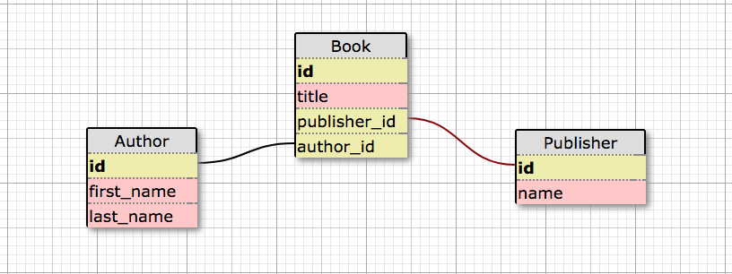
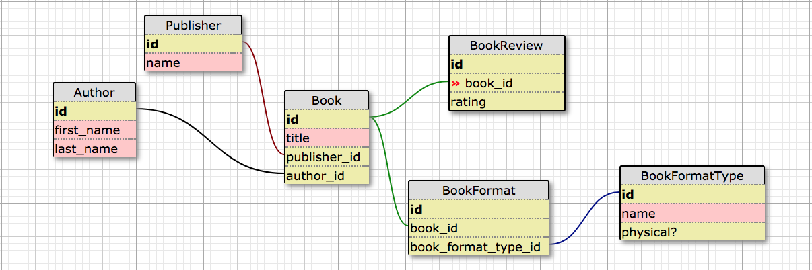

# Tarakeet Rails Challenge

This Rails application is a database for fictional online book-store, implemented as a take-home challenge by Casey Macaulay.

## Iteration 0: Book, Publisher & Author Model Set-up

This challenge asks for a Book model to be created with its corresponding migrations. In looking at the three required fields for Book - title, publisher_id, and author_id - it is clear that all three models are required to correctly build out the relationships. My first step was to design this basic schema (I like to use [this](http://ondras.zarovi.cz/sql/demo/) tool.):

Now that I know what schema is necessary to build out my Book model, I'm able to start my Rails application and create the necessary migrations. Once [my schema reflects the ERD](https://github.com/cmacaulay/tarakeet-books/pulls?q=is%3Apr+is%3Aclosed), I'm able to move on and finish building out the models required to complete the application.

## Iteration 1: Completing the Schema with BookFormatType, BookFormat & BookReview

In looking at the instance methods required to complete my Book model, it is clear that this database is not yet complete. We'll take a look at the required class methods a little later on.

+ book_format_types: will require BookFormatType and BookFormat models to exist.
+ author_name: we can use the existing Author model to implement.
+ average_rating: requires we have a BookReview table as well.

As a visual person, it's important that when I add tables to a database, I see how what the final product might look like first - back to the Schema designer!

Now that I know what the final database should be set up like, it's back to Rails and time to start creating migrations to generate the new tables, and build out the new models.

## Iteration 2: Instance Methods of Book

With our database schema fully built out, we are now able to start working on the required instance methods of book:

+ book_format_types:  Returns a collection of the BookFormatTypes this book is available in
+ author_name:  The name of the author of this book in “lastname, firstname” format
+ average_rating:  The average (mean) of all the book reviews for this book.  Rounded to one decimal place.

While I haven't mentioned it yet, I have been using TDD throughout this project so far, but I'm going to start relying even more heavily on it here. It is the best way to ensure our methods are returning what we expect! In looking at these instance methods, it is clear that we'll soon know whether or not our relationships have been set up correctly. You may have noticed that in each model test I make sure there's a valid Factory, which is basically dummy data for the testing environment. These factories will be useful in testing the instance methods, as I will easily be able to generate data to test against.

## Iteration 2.5: Refactor!

I have been refactoring my code throughout developing this app, but sometimes it's easy to feel like you're building momentum and breezing through features and when that happens code quality can suffer. A bulk of this application has been built, with (an albeit large!) class method left to meet the spec. This seems like a great place to take the time to go through the code that has already been written, and see if there are areas where we can refactor.

## Iteration 3: Implementing the search query class method on Book

This final piece of the application will likely take the longest, and can definitely been broken down into smaller chunks. The spec is asking for a class method on Book that returns a collection of books defined by the query, and options. The following rules will apply:

1. If the last name of the author matches the query string exactly (case insensitive)
2. If the name of the publisher matches the query string exactly (case insensitive)
3. If any portion of the book’s title matches the query string (case insensitive)
4. The results should be ordered by average rating, with the highest rating first.  
5. The list should be unique (the same book shouldn't appear multiple times in the results).

The search options are as follows, and you should be able to query with multiple search options:

+ :title_only (defaults to false).  If true, only return results from rule #3 above.  
+ :book_format_type_id (defaults to nil).  If true, only return books that are available in a format that matches the supplied type id.  
+ :book_format_physical (defaults to nil).   If supplied as true or false, only return books that are available in a format whose “physical” field matches the supplied argument.  This filter is not applied if the argument is not present or nil.  

When it comes to bigger problems like this, I like to break it down into smaller more accessible chunks. I can identify a few of these already:
* Sort a collection of books by their ratings from highest to lowest
* If nil is passed through as both arguments, it should return a all books, ordered by average ratings
* Setting the default options
* Ensuring only unique records are returned

When it comes to the query, I like to think of it as what might be typed into a search bar on a website - we are looking to try and match records as closely to what's in the query as possible. The options are what helps us scope down the results, and make what is returned more specific. Knowing that, it is clear that first we will have to find all results that meet the query, and then narrow it down based off the options entered.
